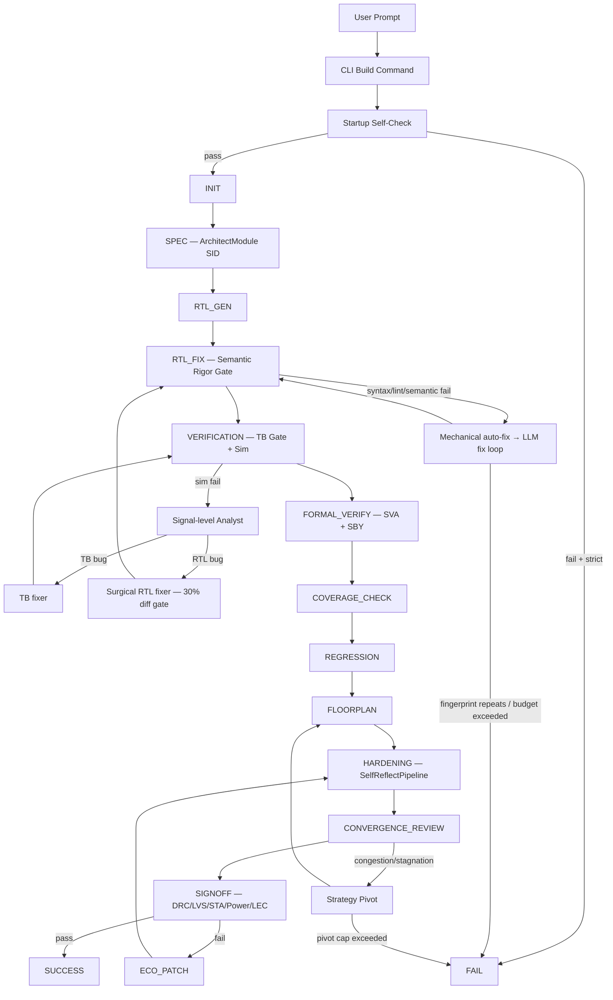

# AgentIC: Tier-1 Autonomous Text-to-Silicon


AgentIC converts natural-language hardware intent into RTL, verification artifacts, and OpenLane physical implementation with autonomous repair loops, multi-agent collaboration, and research-grade core modules.

## Why this version is different

AgentIC is built to avoid two expensive failure modes:

1. **Silent quality regression**: weak checks passing bad designs.
2. **Infinite churn**: retrying the same failing strategy forever.

Every gate is fail-closed by default. Every loop has a budget. Every repair has a fingerprint guard.

---

## Core Modules (`src/agentic/core/`)

Five research-grade modules live in `src/agentic/core/`. Two are fully wired into the pipeline; three are implemented and available for wiring.

| Module | Class | Status | Wired Into | Based On |
|--------|-------|--------|------------|----------|
| `architect.py` | `ArchitectModule` | **Active** | `do_spec()` | Spec2RTL-Agent |
| `self_reflect.py` | `SelfReflectPipeline` | **Active** | `do_hardening()` | Self-Reflection Retry |
| `react_agent.py` | `ReActAgent` | Implemented, not wired | — | ReAct (Yao et al., 2023) |
| `waveform_expert.py` | `WaveformExpertModule` | Implemented, not wired | — | VerilogCoder AST-tracing |
| `deep_debugger.py` | `DeepDebuggerModule` | Implemented, not wired | — | FVDebug balanced analysis |

### ArchitectModule — Spec Decomposer (`do_spec`)

Before writing any Verilog, `ArchitectModule` reads the input spec and produces a **Structured Information Dictionary (SID)** in JSON:

```json
{
  "design_name": "uart_tx",
  "chip_family": "UART",
  "top_module": "uart_tx",
  "sub_modules": [{
    "name": "uart_tx",
    "ports": [{"name": "clk", "direction": "input", "width": "1"}, "..."],
    "functional_logic": "Complete behavioral description...",
    "fsm_states": [{"name": "IDLE", "transitions": ["..."]}]
  }],
  "verification_hints": ["Test baud rate accuracy at ±2%"]
}
```

This JSON contract is the **single source of truth** for all downstream agents — RTL designer, TB generator, verifier. It eliminates ambiguous prose specs being interpreted differently by each agent.

**Fallback**: If SID decomposition fails for any reason, `do_spec()` falls back to the Crew-based MAS generation path.

### SelfReflectPipeline — Hardening Recovery (`do_hardening`)

When OpenLane hardening fails, the pipeline does not give up:

1. **Categorises** the failure (timing, congestion, DRC, area overflow, etc.)
2. **Reflects** using LLM — structured root-cause analysis with full convergence history
3. **Proposes** corrective actions (area expansion, constraint relaxation, RTL pipelining)
4. **Applies** fix + retries (up to 3 times)
5. **Detects stagnation** — aborts early if metrics diverge across consecutive iterations

### ReActAgent — Reasoning Framework (available, not yet wired)

Implements the Thought → Action → Observation loop from the ReAct paper. Factory functions exist for RTL Debugger (8 steps), Formal Verification Debugger (10 steps), and Spec2RTL Architect (6 steps) roles. Not currently imported by the orchestrator — ready to replace the CrewAI Task loops in future.

### WaveformExpertModule — VCD + AST Back-trace (available, not yet wired)

Parses VCD simulation dumps and uses Pyverilog AST analysis to trace a wrong output signal back to the specific RTL line and always block that drives it. Intended for the simulation failure diagnosis path as a deterministic pre-filter before the LLM analyst. Not currently called from `do_verification()`.

### DeepDebuggerModule — Formal Debug (available, not yet wired)

Implements the FVDebug "Balanced Analysis" protocol: runs SymbiYosys, builds signal causal graphs, applies For-and-Against reasoning to isolate the failing property's root cause in RTL. Intended to replace the LLM-only formal failure path. Not currently called from `do_formal_verify()`.

---

## Multi-Agent Collaboration

All agents have **tools** (`syntax_check`, `read_file`) and work in **collaborative crews**:

| Agent | File | Tools | Role |
|-------|------|-------|------|
| RTL Designer | `designer.py` | `syntax_check`, `read_file` | Generates RTL; self-verifies before returning |
| Testbench Designer | `testbench_designer.py` | `syntax_check`, `read_file` | Verilator-safe flat procedural TBs |
| Error Analyst | `verifier.py` | `syntax_check`, `read_file` | Signal-level failure diagnosis |
| Verification Engineer | `verifier.py` | `syntax_check`, `read_file` | SVA assertions, Yosys-compatible |
| Regression Architect | `verifier.py` | `syntax_check`, `read_file` | Directed corner-case test plans |
| Doc Agent | `doc_agent.py` | — | Design documentation |
| SDC Agent | `sdc_agent.py` | — | Timing constraints |

---

## Pipeline State Machine

```
INIT → SPEC → RTL_GEN → RTL_FIX → VERIFICATION → FORMAL_VERIFY
     → COVERAGE_CHECK → REGRESSION → SDC_GEN → FLOORPLAN
     → HARDENING → CONVERGENCE_REVIEW → SIGNOFF → SUCCESS / FAIL
```

Optional recovery loop:
```
SIGNOFF fail → ECO_PATCH → HARDENING → CONVERGENCE_REVIEW
```

### Stage details

1. **INIT** — Startup self-check validates toolchain, environment, selected profile.
2. **SPEC** — `ArchitectModule` decomposes spec into SID JSON. Falls back to Crew-MAS if needed.
3. **RTL_GEN** — Golden-template match first; LLM RTL generation fallback. Strategy: `SV_MODULAR` → `VERILOG_CLASSIC` pivot if CrewAI crashes.
4. **RTL_FIX** — Syntax + lint + semantic rigor gate. Mechanical width auto-fix first, then LLM. Fingerprint detection kills repeating loops.
5. **VERIFICATION** — TB static gate → TB compile gate → simulation → signal-level failure analysis → surgical RTL or TB fix.
6. **FORMAL_VERIFY** — SVA generation → Yosys compatibility preflight → SymbiYosys run. Bounded SVA regeneration on failure; graceful degrade to coverage path.
7. **COVERAGE_CHECK** — Profile-driven closure loop; anti-regression guard; best-TB snapshot restore.
8. **REGRESSION** — Directed scenario generation and execution.
9. **SDC_GEN** — Timing constraint generation for synthesis/STA.
10. **FLOORPLAN** — LLM + heuristic floorplan estimation and TCL artifact generation.
11. **HARDENING** — OpenLane wrapped with `SelfReflectPipeline` — auto-retry with convergence tracking.
12. **CONVERGENCE_REVIEW** — WNS/TNS/congestion trend analysis; strategy pivot trigger.
13. **ECO_PATCH** — Focused ECO corrections when signoff/convergence requires it.
14. **SIGNOFF** — DRC/LVS/STA/Power/IR-drop/LEC aggregation to final pass/fail.
15. **SUCCESS / FAIL** — Artifact map + benchmark metrics snapshot.

---

## Architecture diagram



---

## Quality gates (strict mode)

| Stage | Gate |
|-------|------|
| Startup | Required tools + env must resolve |
| RTL Fix | Syntax + lint + semantic rigor (width/port) must pass |
| Verification | TB compile gate + simulation must pass |
| Formal | Bounded SVA self-heal; graceful degrade to coverage on exhaustion |
| Coverage | Profile-driven loop; anti-regression; best-effort proceed after bounded attempts |
| Signoff | DRC/LVS/STA/power/IR/LEC all contribute to final pass/fail |

---

## Autonomous repair subsystems

### Width auto-fix (mechanical, no LLM)

`auto_fix_width_warnings()` in `vlsi_tools.py`:
- Runs Verilator `-Wall`, parses `WIDTHTRUNC`/`WIDTHEXPAND` warnings
- Applies bit-slice or zero-extension directly to the RTL file
- Re-runs Verilator to verify; falls back to LLM with rich context if it cannot fix mechanically
- Regex handles Verilator's `expects N or M bits` format and `VARREF 'name'` signal extraction

### Surgical RTL fixer (from sim failure path)

When a simulation failure is diagnosed as an RTL logic bug:
- Analyst produces 7 structured fields: `FAILING_OUTPUT`, `FAILING_SIGNALS`, `EXPECTED_VS_ACTUAL`, `RESPONSIBLE_CONSTRUCT`, `ROOT_CAUSE`, `FIX_HINT`
- Fixer is instructed to make the **minimum change** — no rewrites, no restructuring
- After fix: `difflib.SequenceMatcher` checks changed-line ratio. If >30%, the fix is **rejected** and the fixer is re-prompted for a more surgical approach
- Sets `rtl_changed_from_sim_fix` flag for downstream TB handling

### TB regen after RTL structural change

If RTL was changed from the sim-failure repair path and the existing TB then fails TB compile gate, the stale TB is immediately deleted and a fresh TB is generated against the updated RTL — skipping the multi-cycle repair attempts on an incompatible testbench.

### TB stimulus/checking integrity

All TB generation prompts enforce:
- Store all stimulus values in a `stim_array` before applying to DUT
- Checking phase reads only from `stim_array` — never generates a new random value during checking

---

## New in March 2026 (all validated)

| Fix | Location | What changed |
|-----|----------|-------------|
| Multi-file Verilator compilation | `vlsi_tools.py` — 6 functions | All Verilator/iverilog calls now glob `*.v + *.sv`, excluding `_tb.v` and `regression` files |
| SymbiYosys multi-file | `vlsi_tools.py` — `write_sby_config` | Globs all RTL for `[files]` and `[script]`; excludes `_sva.sv`; working dir moved to `formal/` |
| Yosys SVA preflight | `orchestrator.py` — `do_formal_verify` | Runs `yosys -p "read_verilog -formal -sv ..."` on generated SVA before sby; rejects and regenerates on failure |
| Width warning regex | `orchestrator.py` + `vlsi_tools.py` | Handles `expects 32 or 5 bits` format; extracts signal from `VARREF 'name'` pattern |
| Mechanical width auto-fix | `vlsi_tools.py` — `auto_fix_width_warnings` | Post-processor fixes WIDTHTRUNC/WIDTHEXPAND; builds rich context for LLM when expression is unfixable |
| CrewAI crash handling | `orchestrator.py` — `do_rtl_gen/fix` | try/except around `.kickoff()`; strategy pivot on crash |
| LLM reasoning-output guard | `orchestrator.py` — `do_rtl_fix` | VERILOG-ONLY preamble; parse retry re-prompt on no-code response |
| TB stimulus storage rule | `testbench_designer.py` | `stim_array` pattern enforced in `TB_UNIVERSAL_RULES` |
| Signal-level failure analyst | `verifier.py` + `orchestrator.py` | 7-field structured diagnosis; analyst must cite specific RTL line and construct |
| Surgical RTL fixer + 30% diff gate | `orchestrator.py` — `do_verification` | `difflib` ratio check; rejection + surgical retry if >30% lines changed |
| TB regen after sim-fix RTL change | `orchestrator.py` — `do_verification` | `rtl_changed_from_sim_fix` flag; immediate TB deletion + regen on compile gate failure |

---

## Project layout

```text
AgentIC/
├── main.py
├── src/agentic/
│   ├── cli.py
│   ├── config.py
│   ├── orchestrator.py             # 3600+ line state machine (16 states)
│   ├── agents/
│   │   ├── designer.py             # RTL Designer (SV_MODULAR + VERILOG_CLASSIC, tools)
│   │   ├── testbench_designer.py   # TB Designer (Verilator-safe, stim_array rules)
│   │   ├── verifier.py             # Error Analyst (signal-level) + Verif + Regression
│   │   ├── doc_agent.py
│   │   └── sdc_agent.py
│   ├── core/                       # Research-grade modules
│   │   ├── architect.py            # [ACTIVE] Spec2RTL SID decomposer → do_spec()
│   │   ├── self_reflect.py         # [ACTIVE] Self-reflection retry → do_hardening()
│   │   ├── react_agent.py          # [READY]  ReAct framework — not yet wired
│   │   ├── waveform_expert.py      # [READY]  VCD + AST back-trace — not yet wired
│   │   └── deep_debugger.py        # [READY]  FVDebug formal debug — not yet wired
│   └── tools/vlsi_tools.py         # 3700+ lines of EDA tool wrappers
├── server/                         # FastAPI backend (SSE streaming)
├── web/                            # React 19 + Vite 7 frontend
├── tests/test_tier1_upgrade.py
├── scripts/ci/
│   ├── smoke.sh
│   └── nightly_full.sh
└── .github/workflows/ci.yml
```

---

## CLI quick start

### Standard strict build
```bash
python3 main.py build \
  --name my_chip \
  --desc "32-bit APB timer with interrupt" \
  --strict-gates
```

### Skip physical implementation
```bash
python3 main.py build \
  --name fifo_sync \
  --desc "Synchronous FIFO 8-bit 16-entry" \
  --skip-openlane \
  --strict-gates
```

### Full signoff
```bash
python3 main.py build \
  --name uart_tx \
  --desc "UART transmitter 115200 baud" \
  --full-signoff \
  --pdk-profile sky130
```

## Build options

```text
--strict-gates / --no-strict-gates   (default: strict)
--skip-openlane                      Skip physical implementation
--pdk-profile {sky130,gf180}         (default: sky130)
--max-pivots N                       (default: 2)
--congestion-threshold FLOAT         (default: 10.0)
--hierarchical {auto,off,on}         (default: auto)
--max-retries N                      LLM fix retry budget
--min-coverage FLOAT                 Coverage closure target
--full-signoff                       Run DRC/LVS/STA/Power/LEC
```

---

## Installation

### Prerequisites

- Linux / WSL2
- Python 3.10+
- Verilator 5.x
- Icarus Verilog (`iverilog`, `vvp`)
- OSS-CAD-suite (for `sby`, `yosys`, `eqy`)
- OpenLane + Docker (for physical implementation)

### Setup

```bash
git clone https://github.com/Vickyrrrrrr/AgentIC.git
cd AgentIC
python3 -m venv .venv
source .venv/bin/activate
pip install -r requirements.txt
```

Configure `.env`:

```bash
# LLM backend — cloud
NVIDIA_API_KEY="..."
# or local
LLM_BASE_URL="http://localhost:11434"

# Physical flow roots
OPENLANE_ROOT="/home/user/OpenLane"
PDK_ROOT="/home/user/.ciel"
```

---

## CI model

- **PR smoke**: Python compile check + Tier-1 unit tests (`tests/test_tier1_upgrade.py`)
- **Nightly**: Smoke first, then full build+signoff when environment is available

Files: `.github/workflows/ci.yml`, `scripts/ci/smoke.sh`, `scripts/ci/nightly_full.sh`

```bash
bash scripts/ci/smoke.sh
```

---

## Key generated artifacts

| Artifact | Location |
|----------|----------|
| RTL source | `designs/<name>/src/<name>.v` |
| Testbench | `designs/<name>/src/<name>_tb.v` |
| SVA assertions | `designs/<name>/src/<name>_sva.sv` |
| Yosys-compatible SVA | `designs/<name>/src/<name>_sby_check.sv` |
| Formal config | `designs/<name>/formal/<name>.sby` |
| OpenLane config | `designs/<name>/config.tcl` |
| SDC constraints | `designs/<name>/src/<name>.sdc` |
| Floorplan TCL | `designs/<name>/macro_placement.tcl` |
| LEC config | `designs/<name>/<name>.eqy` |
| ECO patch | `designs/<name>/<name>_eco_patch.tcl` |
| IP manifest | `designs/<name>/ip_manifest.json` |
| Benchmark snapshot | `metircs/<name>/latest.json` |
| Human-readable metrics | `metircs/<name>/latest.md` |

---

## Practical boundaries

- ECO and hierarchy are production-oriented scaffolds — concrete artifacts and control flow, not yet a full foundry-tuned incremental optimization stack.
- Portability means adapter-based OSS-PDK support (sky130, gf180), not tapeout certification.
- `WaveformExpertModule`, `DeepDebuggerModule`, and `ReActAgent` are implemented and tested in isolation but not yet integrated into the main orchestrator pipeline.

---

## License

Proprietary and Confidential.  
Copyright © 2026 Vicky Nishad. All rights reserved.

