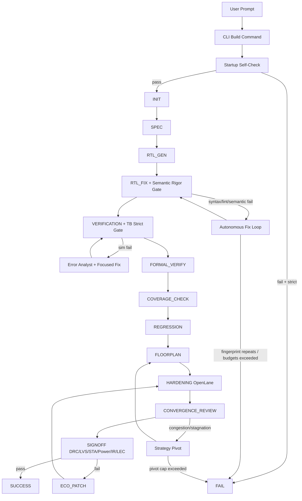

# AgentIC: Tier-1 Autonomous Text-to-Silicon


AgentIC converts natural-language hardware intent into RTL, verification artifacts, and OpenLane physical implementation with autonomous repair loops, multi-agent collaboration, and research-grade core modules.

This README reflects the **Tier-1 + Self-Healing vNext + Multi-Agent Architecture upgrade**: strict core gates, bounded loop control, collaborative agent crews, structured spec decomposition (SID), self-reflective hardening retry, tool-equipped agents, and Verilator-safe verification pipeline.

## Why this version is different

AgentIC is now built to avoid two expensive failure modes:

1. **Silent quality regression**: weak checks passing bad designs.
2. **Infinite churn**: retrying the same failing strategy forever.

Tier-1 addresses both.

## Core Modules (Research-Grade Pipeline)

AgentIC includes five research-grade core modules in `src/agentic/core/` — all wired into the orchestrator pipeline:

| Module | Based On | Purpose | Integration Point |
|--------|----------|---------|-------------------|
| **ArchitectModule** | Spec2RTL-Agent | Structured spec decomposition → validated JSON contract (SID) | `do_spec()` — primary path |
| **SelfReflectPipeline** | Self-Reflection Retry | Autonomous retry with convergence tracking, failure fingerprinting, stagnation detection | `do_hardening()` — wraps OpenLane |
| **ReActAgent** | ReAct (Yao et al., 2023) | Structured Thought→Action→Observation reasoning framework | Available for all agent loops |
| **WaveformExpertModule** | VerilogCoder AST-tracing | VCD parsing + Pyverilog AST back-trace to find failing signal/line | Simulation failure diagnosis |
| **DeepDebuggerModule** | FVDebug balanced analysis | SymbiYosys + causal graphs + For-and-Against protocol | Formal verification debugging |

### ArchitectModule (Structured Spec Decomposition)

Before writing any Verilog, the ArchitectModule reads the input spec and produces a **Structured Information Dictionary (SID)** in JSON:

```json
{
  "design_name": "uart_tx",
  "chip_family": "UART",
  "top_module": "uart_tx",
  "sub_modules": [{
    "name": "uart_tx",
    "ports": [{"name": "clk", "direction": "input", "width": "1"}, ...],
    "functional_logic": "Complete behavioral description...",
    "fsm_states": [{"name": "IDLE", "transitions": [...]}]
  }],
  "verification_hints": ["Test baud rate accuracy at ±2%"]
}
```

This JSON contract becomes the **single source of truth** for all downstream agents — eliminating ambiguity and hallucination.

### SelfReflectPipeline (Hardening Recovery)

When OpenLane hardening fails, the pipeline doesn't just give up:

1. **Categorizes** the failure (timing violation, routing congestion, DRC, etc.)
2. **Reflects** using LLM — structured root-cause analysis with convergence history
3. **Proposes** corrective actions (area expansion, constraint relaxation, RTL pipelining)
4. **Applies** fixes and retries (up to 3 times)
5. **Detects stagnation** — aborts early if metrics are diverging

## Multi-Agent Collaboration

All agents now have **tools** (syntax checker + file reader) and work in **collaborative crews**:

| Agent | Tools | Collaboration |
|-------|-------|---------------|
| RTL Designer | `syntax_check`, `read_file` | 2-agent Crew with RTL Reviewer |
| RTL Reviewer | `syntax_check`, `read_file` | Reviews designer output before committing |
| Testbench Designer | `syntax_check`, `read_file` | Verilator-safe methodology, self-verifies |
| Error Analyst | `syntax_check`, `read_file` | Diagnoses failures with file reading |
| Verification Engineer | `syntax_check`, `read_file` | SVA assertions, Verilator-compatible |
| Regression Architect | `syntax_check`, `read_file` | Creates corner-case test plans |

## Tier-1 upgrade highlights

- **Fail-closed mode is first-class** (`--strict-gates` default).
- **Startup toolchain self-check** before build starts.
- **Deterministic semantic preflight** for:
  - width mismatch diagnostics,
  - port shadowing rejection.
- **Loop safety controls**:
  - failure fingerprint detection,
  - per-state retries,
  - global step budget,
  - capped strategy pivots.
- **EDA intelligence layer** to summarize large logs into structured top issues.
- **Physical feedback loop** with:
  - floorplan stage,
  - congestion assessment,
  - convergence assessor,
  - ECO stage.
- **Signoff upgrades**:
  - multi-corner STA parsing (setup + hold),
  - numeric power + IR-drop parsing,
  - EQY-based LEC check.
- **Hierarchy/IP scaling scaffold**:
  - auto hierarchy planner,
  - per-block artifact emission,
  - reusable `ip_manifest.json`.
- **CI split**:
  - PR smoke checks,
  - nightly full-flow path.

## New in Self-Healing vNext (March 2026)

- **Multi-agent collaborative crews**: RTL generation uses a 2-agent Crew (Designer + Reviewer). Error analysis diagnosis feeds directly into the fixer agent's prompt.
- **All agents have tools**: Designer, Testbench, Verifier, Error Analyst, and Regression agents all have `syntax_check` and `read_file` tools — they can self-verify their output before returning it.
- **ArchitectModule integration**: `do_spec()` now uses the structured SID decomposer — produces a validated JSON contract with ports, FSM states, sub-modules, and verification hints.
- **SelfReflectPipeline integration**: `do_hardening()` wraps OpenLane with self-reflective retry — failure categorization, convergence tracking, and stagnation detection.
- **Verilator-safe verification pipeline**: TB prompts, agent backstories, and static gates are all aligned — no more contradictions between what the LLM is told to generate and what the compiler accepts.
- **Universal stage exception guard**: each state handler executes through a safe wrapper that retries essential stages and skips non-essential stages when needed.
- **Formal self-healing loop**:
  - SVA preflight/solver failures trigger bounded SVA regeneration,
  - persistent formal issues degrade gracefully to coverage instead of hard-stop.
- **Coverage anti-regression guard**:
  - candidate TBs must pass compile gate,
  - candidate coverage must not regress beyond guardrail,
  - best TB snapshot is restored automatically.
- **Coverage thresholds now profile-driven**:
  - branch gate uses profile threshold (not hardcoded 95%),
  - toggle gate is skipped for Verilator-style backends where toggle metrics are unavailable.
- **Verification recovery hardening**:
  - repeated simulation fingerprints trigger deterministic TB fallback,
  - RTL/TB write failures are retried instead of immediate fail.
- **OpenLane config-path robustness**:
  - host config paths are translated to Docker-mounted `/openlane/...` paths.

## Architecture (easy view)



  ## Complete flow (current)

  1. **INIT**
    - Startup self-check validates toolchain, environment, and selected profile.
  2. **SPEC**
    - ArchitectModule decomposes spec into Structured Information Dictionary (SID/JSON).
    - Validated JSON contract with ports, FSM states, sub-modules, verification hints.
    - Fallback to Crew-based MAS generation if SID decomposition fails.
  3. **RTL_GEN**
    - Golden-template matching first, LLM RTL generation fallback.
  4. **RTL_FIX**
    - Syntax/lint/semantic checks with bounded repair loop and strategy pivoting.
  5. **VERIFICATION**
    - TB static + compile gate, simulation run, multi-class failure diagnosis (TB/RTL/ports/timing/architecture), deterministic + LLM-assisted recovery.
  6. **FORMAL_VERIFY**
    - SVA generation → Yosys conversion → preflight validation → SymbiYosys run.
    - On failures: bounded SVA regeneration before graceful degrade.
  7. **COVERAGE_CHECK**
    - Adapter-based coverage, profile thresholds, anti-regression TB improvement loop.
    - On repeated non-closure: restores best TB and continues.
  8. **REGRESSION** (optional by mode)
    - Directed scenario generation and execution.
  9. **SDC_GEN**
    - Generates timing constraints for synthesis/STA.
  10. **FLOORPLAN**
     - LLM + heuristic floorplan estimation and TCL artifact generation.
  11. **HARDENING**
     - OpenLane run wrapped with SelfReflectPipeline — auto-retry with root-cause analysis, convergence tracking, and stagnation detection.
  12. **CONVERGENCE_REVIEW**
     - Assesses WNS/TNS/congestion trend and triggers pivots when needed.
  13. **ECO_PATCH** (if signoff/convergence requires)
     - Applies focused ECO corrections and re-runs implementation path.
  14. **SIGNOFF**
     - DRC/LVS/STA/Power/IR + LEC aggregation to final pass/fail.
  15. **SUCCESS / FAIL**
     - Emits final artifact map and benchmark metrics snapshot.

  Across all stages, a **safe dispatcher** guards unexpected exceptions with bounded retry/skip policy.

## Autonomous repair model

AgentIC is not just an error printer. It has repair loops with decision logic.

### Loop behavior

- For compile/sim failures, it classifies cause (**TB vs RTL**) and applies targeted fixes.
- For large logs, it passes a **structured summary** instead of dumping raw text into prompts.
- If the same `(state + error + artifact fingerprint)` repeats, it fails closed instead of spinning.

### Convergence behavior

- Tracks timing/congestion snapshots per iteration.
- If WNS stagnates (< 0.01ns improvement for 2 consecutive iterations), triggers strategy pivot:
  1. timing constraint tune,
  2. area expansion,
  3. logic decoupling hint (register slicing),
  4. fail closed if capped pivots are exhausted.

## Quality gates (strict mode)

| Stage | Gate |
|---|---|
| Startup | required tools + environment must resolve |
| RTL Fix | syntax + lint + semantic rigor must pass |
| Verification | TB contract + simulation must pass |
| Formal | bounded self-heal first; persistent failures can degrade to coverage path |
| Coverage | profile-driven closure loop with anti-regression; best-effort proceed after bounded attempts |
| Regression | regression failures are blocking |
| Signoff | DRC/LVS/STA/power/IR/LEC all contribute to final pass/fail |

## Before vs now (upgrade summary)

| Capability | Before | Now |
|---|---|---|
| Stage crash handling | Global try/except only | Per-stage guarded execution with retry/skip policy |
| Formal failures | Could hard-stop in strict mode | Regenerates SVA and degrades gracefully when exhausted |
| Coverage improvement | Could accept worse TBs | Compile-gated, anti-regression, best-TB restore |
| Coverage branch gate | Hardcoded high branch target | Uses profile threshold (`balanced/aggressive/relaxed`) |
| Verilator toggle gate | Could fail on missing toggle realism | Toggle gate bypass where backend lacks toggle fidelity |
| OpenLane config pathing | Host-path mismatch risk in Docker | Host path remapped to Docker `/openlane` namespace |

## PDK portability model

AgentIC uses an adapter-style OSS-PDK profile model.

Supported profiles now:

- `sky130`
- `gf180`

This is **portability support**, not foundry certification.

## CLI quick start

### 1) Standard strict build

```bash
python3 main.py build \
  --name my_chip \
  --desc "32-bit APB timer with interrupt" \
  --full-signoff
```

### 2) Portable profile selection

```bash
python3 main.py build \
  --name my_fifo \
  --desc "Dual-clock FIFO with status flags" \
  --pdk-profile sky130 \
  --strict-gates
```

### 3) Tune convergence controls

```bash
python3 main.py build \
  --name deep_pipeline \
  --desc "Pipelined datapath with valid/ready" \
  --max-pivots 2 \
  --congestion-threshold 10 \
  --hierarchical auto
```

## Build command options (Tier-1)

```text
--strict-gates / --no-strict-gates   (default: strict)
--pdk-profile {sky130,gf180}         (default: sky130)
--max-pivots N                        (default: 2)
--congestion-threshold FLOAT          (default: 10.0)
--hierarchical {auto,off,on}          (default: auto)
```

Existing options remain (`--skip-openlane`, `--full-signoff`, `--min-coverage`, `--max-retries`, etc.).

## Human-readable architecture internals

### Orchestrator states

`INIT -> SPEC -> RTL_GEN -> RTL_FIX -> VERIFICATION -> FORMAL_VERIFY -> COVERAGE_CHECK -> REGRESSION -> FLOORPLAN -> HARDENING -> CONVERGENCE_REVIEW -> SIGNOFF -> SUCCESS/FAIL`

With optional recovery path:

`SIGNOFF fail -> ECO_PATCH -> HARDENING -> CONVERGENCE_REVIEW`

### Key generated artifacts

- `config.tcl` (OpenLane config)
- `macro_placement.tcl` (floorplan macro scaffold)
- `<design>.eqy` (LEC config)
- `<design>_eco_patch.tcl` (ECO patch artifact)
- `ip_manifest.json` (reusable block metadata)
- `src/blocks/*.v` (hierarchy-enabled block artifacts)
- `metircs/<design>/latest.json` (industry benchmark snapshot)
- `metircs/<design>/latest.md` (human-readable benchmark table)

## CI model

### PR smoke checks

- Python compile check for `src/agentic`
- Tier-1 unit tests (`tests/test_tier1_upgrade.py`)

### Nightly full checks

- Runs smoke first
- Attempts full build+signoff path when environment is available

Files:

- `.github/workflows/ci.yml`
- `scripts/ci/smoke.sh`
- `scripts/ci/nightly_full.sh`

## Tests included for Tier-1

- conflict marker integrity checks
- semantic gate checks (port shadowing)
- log parser behavior on large synthetic logs
- multi-corner STA parser correctness
- congestion parser correctness
- loop fingerprint guard behavior
- hierarchy threshold activation

Run locally:

```bash
bash scripts/ci/smoke.sh
```

## Installation

### Prerequisites

- Linux / WSL2
- Python 3.10+
- Docker
- Verilator
- Icarus Verilog (`iverilog`, `vvp`)
- OpenLane installation
- OSS CAD tools for formal/LEC (`sby`, `yosys`, `eqy`)

### Setup

```bash
git clone https://github.com/Vickyrrrrrr/AgentIC.git
cd AgentIC
python3 -m venv .venv
source .venv/bin/activate
pip install -r requirements.txt
```

Configure `.env` (minimum):

```bash
# LLM backend
NVIDIA_API_KEY="..."          # cloud path
# or
LLM_BASE_URL="http://localhost:11434"  # local path

# Physical flow roots
OPENLANE_ROOT="/home/user/OpenLane"
PDK_ROOT="/home/user/.ciel"
```

## Practical boundaries (current implementation)

- ECO and hierarchy are production-oriented scaffolds in this phase, with concrete artifacts and control flow, but not yet a full foundry-tuned incremental optimization stack.
- Portability means adapter-based OSS-PDK support, not tapeout certification claims.

## Project layout

```text
AgentIC/
├── main.py
├── src/agentic/
│   ├── cli.py
│   ├── config.py
│   ├── orchestrator.py          # 3400+ line state machine (16 states)
│   ├── agents/
│   │   ├── designer.py          # RTL Designer agent (with tools)
│   │   ├── testbench_designer.py # TB Designer agent (Verilator-safe)
│   │   ├── verifier.py          # Error Analyst + Verification + Regression
│   │   ├── doc_agent.py
│   │   └── sdc_agent.py
│   ├── core/                    # Research-grade pipeline modules
│   │   ├── architect.py         # Spec2RTL SID decomposer
│   │   ├── react_agent.py       # ReAct reasoning framework
│   │   ├── self_reflect.py      # Self-reflection retry pipeline
│   │   ├── deep_debugger.py     # FVDebug balanced analysis
│   │   └── waveform_expert.py   # VCD + AST waveform tracing
│   └── tools/vlsi_tools.py      # 3400+ lines of EDA tool wrappers
├── server/                      # FastAPI backend (SSE streaming)
├── web/                         # React 19 + Vite 7 frontend
├── tests/test_tier1_upgrade.py
├── scripts/ci/
└── .github/workflows/ci.yml
```

## License

Proprietary and Confidential.

Copyright (c) 2026 Vicky Nishad.
All rights reserved.
