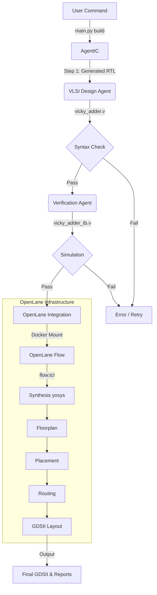

# AgentIC Workflow Guide

This document outlines the automated chip design workflow using **AgentIC** and **OpenLane**.

## Logic Flow

The system transforms natural language descriptions into physical GDSII manufacturing files through a multi-step agentic pipeline.



## Directory Structure & Important Files

The workspace is consolidated into two main components:

### 1. AgentIC ( The "Brain" )
Controls the process.
- **`main.py`**: The entry point.
- **`src/agentic/`**: The core Python package.
    - **`agents/`**: AI engineer definitions.
    - **`tools/`**: Interfaces to VLSI tools.
    - **`config.py`**: Configuration settings (paths, LLMs).
- **`scripts/verify_design.sh`**: A helper script for verification.

### 2. OpenLane ( The "Muscle" )
The execution engine.
- **`designs/simple_counter`**: **CRITICAL**. Used as a configuration template for all new AI designs.
- **`designs/<your_design>`**: Where your new chips will be created.
- **`flow.tcl`**: The main script run by the Docker container.

## How to Run

### 1. Build a new chip
```bash
cd ~/AgentIC
python main.py build --name vicky_adder --desc "A 4-bit adder with carry out"
```

### 2. Verify an existing chip
```bash
cd ~/AgentIC
python main.py verify vicky_adder
```

## Maintenance
- **Do not delete** `OpenLane/designs/simple_counter` - it is needed for config generation.
- **Do not delete** the `OpenLane` root files - they are mounted into the Docker container.
