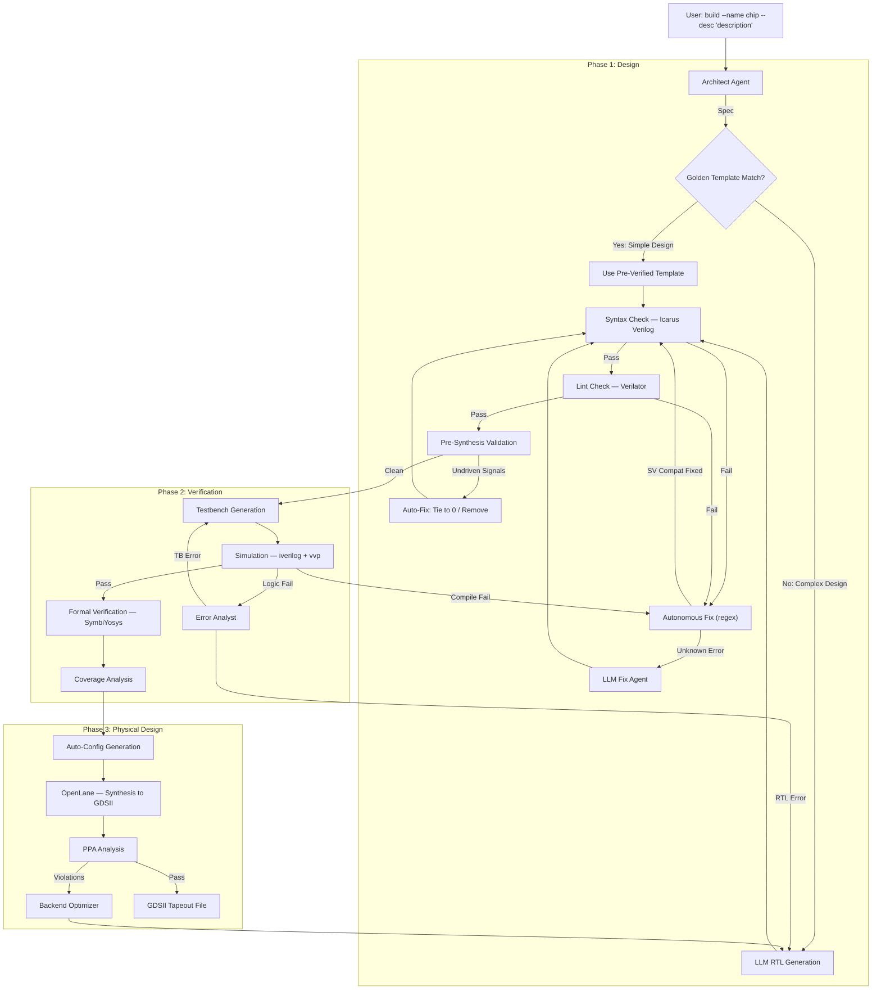

# AgentIC: AI-Powered Text-to-Silicon Compiler

   

**AgentIC** transforms natural language descriptions into verified, manufacturable chip layouts (GDSII). It orchestrates a crew of specialized AI agents through a self-correcting pipeline — from RTL generation through formal verification to physical design — producing industry-standard silicon with minimal human intervention.

> **"Build a radiation-hardened SPI master with TMR"** → Verified RTL → GDSII layout

---

## Architecture



---

## Key Features

### Autonomous Self-Healing Pipeline
AgentIC doesn't just generate code — it detects and fixes errors **without LLM calls** whenever possible:

| Error Type | Detection | Fix | LLM Needed? |
|-----------|-----------|-----|-------------|
| `always_comb` in iverilog | Error log pattern match | `always_comb` → `always @(*)` | ❌ No |
| Explicit type casts | `This assignment requires an explicit cast` | `type'(val)` → `(val)` | ❌ No |
| `unique case` / `priority case` | Error log match | Strip qualifier | ❌ No |
| Undriven signals | Pre-synthesis scan | Tie to 0 or remove | ❌ No |
| TB compilation error | `Compilation failed` in output | SV→Verilog regex fix | ❌ No |
| Logic bugs | `TEST FAILED` in simulation | Error Analyst + Fixer | ✅ Yes |
| Unknown syntax errors | Unmatched error patterns | LLM Syntax Rectifier | ✅ Yes |

### Multi-Agent Crew

| Agent | Role | Tools |
|-------|------|-------|
| **Architect** | Defines micro-architecture, interfaces, and FSM states | Specification generation |
| **Designer** | Writes synthesizable Verilog/SystemVerilog RTL | `write_verilog`, `syntax_check` |
| **Verification Engineer** | Generates SVA assertions (industry + Yosys-compatible) | `convert_sva_to_yosys`, SymbiYosys |
| **Testbench Agent** | Creates self-checking testbenches with port-accurate DUT instantiation | `run_simulation` |
| **Error Analyst** | Classifies failures as RTL vs testbench bugs, directs fixes | Log analysis |
| **Backend Engineer** | Configures OpenLane, optimizes PPA (Power, Performance, Area) | `run_openlane` |

### Golden Reference Library
Pre-verified RTL + testbench pairs for common IP blocks — **95% first-attempt success**:

| Template | Description | Complexity |
|----------|-------------|------------|
| `counter` | N-bit up/down counter with enable and load | Simple |
| `fifo` | Synchronous FIFO with parameterizable width/depth | Medium |
| `uart_tx` | UART Transmitter with configurable baud rate | Medium |
| `spi_master` | SPI Master with configurable CPOL/CPHA | Medium |
| `fsm` | Generic FSM with configurable states | Simple |
| `pwm` | PWM generator with configurable resolution | Simple |
| `timer` | General-purpose timer with prescaler | Medium |
| `shift_register` | Shift register with serial/parallel IO | Simple |

> **Smart Matching**: Complex designs (TMR, AES, DMA, pipelined, radiation-hardened, etc.) automatically bypass templates and use full LLM generation from scratch.

### Auto-Generated OpenLane Config
No manual `config.tcl` needed — the system reads the RTL file, estimates complexity, and generates appropriate die area, clock period, and synthesis settings:

| RTL Size | Die Area | Utilization | Clock Period |
|----------|----------|-------------|-------------|
| < 100 lines (counter, PWM) | 300×300µm | 50% | 10ns |
| 100-300 lines (FIFO, UART, SPI) | 500×500µm | 40% | 15ns |
| 300+ lines (TMR, AES, CPU) | 800×800µm | 35% | 20ns |

### Dual-Mode Formal Verification
- **Industry SVA**: Generates `property`/`assert property` assertions for commercial EDA tools
- **Yosys SVA**: Auto-converts to SymbiYosys format for open-source k-induction proofs

### Resilient LLM Fallback Chain
```
NVIDIA Primary (Qwen3-Coder-480B) → NVIDIA Backup → Groq Cloud → Local Ollama
```
Supports air-gapped deployment with local models for sovereign/defense applications.

### Anti-Hallucination Engine
- Strips `<think>` blocks, `Thought:`/`Action:` lines, markdown fences
- Auto-converts `always_comb` → `always @(*)`, `always_ff @(...)` → `always @(...)`
- Auto-fixes `signed'()` → `$signed()`, type casts, `unique case` → `case`
- Validates every output contains a valid `module` definition before writing
- Security scan blocks `$system`, shell commands, and path traversal attacks

---

## Performance

| Metric | Golden Templates | LLM-Generated |
|--------|-----------------|---------------|
| First-attempt RTL success | ~95% | ~80% |
| Lint pass rate | ~95% | ~90% (with auto-fix) |
| Simulation pass (with retries) | ~95% | ~85% |
| Formal verification | ~70% | ~30% |
| Build completion | ~95% | ~85% |

*Benchmarked on simple-to-medium complexity designs (counters, FIFOs, SPI, UART, FSMs, timers).*

---

## Installation

### Prerequisites
- **Linux/WSL2** (Ubuntu 20.04+)
- **Python 3.10+**
- **Icarus Verilog**: `sudo apt install iverilog`
- **Verilator**: `sudo apt install verilator` (for lint checks)
- **Docker** (for OpenLane physical design)
- **SymbiYosys** (optional, for formal verification — via [OSS CAD Suite](https://github.com/YosysHQ/oss-cad-suite-build))

### Setup

```bash
git clone https://github.com/Vickyrrrrrr/AgentIC.git
cd AgentIC
python -m venv .venv && source .venv/bin/activate
pip install -r requirements.txt
```

Create `.env` in the project root:
```bash
# At least one LLM API key required
NVIDIA_API_KEY="nvapi-..."       # Primary (recommended)
GROQ_API_KEY="gsk_..."           # Fallback
# OPENAI_API_KEY="sk-..."        # Optional

# Tool paths (defaults usually work)
# OPENLANE_ROOT="/home/user/OpenLane"
# PDK_ROOT="/home/user/pdk"
```

---

## Usage

### Build a Chip (Full Pipeline)
```bash
python main.py build \
    --name my_spi_controller \
    --desc "SPI master with configurable clock polarity and 8-bit data width"
```

### Quick RTL Iteration (Skip Physical Design)
```bash
python main.py build \
    --name fast_counter \
    --desc "32-bit counter with overflow detection" \
    --skip-openlane
```

### Complex Design (Full LLM Generation)
```bash
python main.py build \
    --name tmr_processor \
    --desc "Radiation-hardened ALU with Triple Modular Redundancy and majority voting" \
    --skip-openlane --max-retries 5
```

### Other Commands
```bash
# Simulate existing design
python main.py simulate --name my_design --max-retries 10

# Run OpenLane hardening only (auto-generates config.tcl)
python main.py harden --name my_design

# Interactive chat with VLSI tools
python main.py chat
```

### CLI Options
| Option | Description | Default |
|--------|-------------|---------|
| `--name` | Design/module name | Required |
| `--desc` | Natural language description | Required |
| `--skip-openlane` | Stop after verification (skip GDSII) | `False` |
| `--show-thinking` | Display LLM reasoning (CoT) | `False` |
| `--max-retries` | Max auto-fix attempts per stage | `5` |

---

## Project Structure

```
AgentIC/
├── main.py                          # Entry point
├── requirements.txt
├── .env                             # API keys (not committed)
└── src/agentic/
    ├── cli.py                       # CLI commands (build, simulate, harden, chat)
    ├── config.py                    # LLM & path configuration
    ├── orchestrator.py              # Build state machine & pipeline orchestration
    ├── agents/
    │   ├── designer.py              # RTL generation & fixing agent
    │   ├── testbench_designer.py    # Testbench generation agent
    │   └── verifier.py              # SVA & error analysis agents
    ├── golden_lib/
    │   ├── template_matcher.py      # Keyword + complexity-aware template matching
    │   └── templates/               # 8 pre-verified RTL + testbench pairs
    └── tools/
        └── vlsi_tools.py            # write_verilog, syntax/lint/sim/formal/coverage
```

---

## Build Pipeline

```
INIT → SPEC → RTL_GEN → RTL_FIX → VERIFICATION → FORMAL_VERIFY → COVERAGE → HARDENING → SUCCESS
                  ↑          |           |
                  └──────────┘           │  (on failure)
                  ↑                      │
                  └──────────────────────┘
```

### RTL_FIX Stage (Autonomous)
```
Syntax Error? → Check if known SV↔Verilog pattern
    ├── YES → Regex fix instantly (0 LLM calls)
    └── NO  → LLM Fix Agent (with iverilog hints in prompt)

Lint Passed? → Pre-Synthesis Validation
    ├── Undriven signal used? → Tie to 0
    ├── Undriven signal unused? → Remove declaration
    └── All clean → Proceed to Verification
```

### Verification Stage (Autonomous)
```
Simulation failed with "Compilation failed"?
    ├── TB file in error → Auto-fix SV issues in TB
    ├── RTL file in error → Auto-fix SV issues in RTL
    └── Unknown error → LLM Error Analyst → LLM Fixer
```

If SystemVerilog fails after max retries, the system automatically pivots to Verilog-2005 style and restarts.

---

## Troubleshooting

| Problem | Cause | Solution |
|---------|-------|----------|
| Lint fails on unused signals | Verilator `-Wall` too strict | Fixed: uses `-Wno-UNUSED` now |
| `always_comb` errors in iverilog | SV construct not fully supported | Fixed: auto-converted to `always @(*)` |
| Template used for complex design | Keyword matcher too aggressive | Fixed: complexity indicators block simple templates |
| Undriven signal in synthesis | LLM declared but forgot to assign | Fixed: pre-synthesis validation auto-fixes |
| OpenLane deprecated variable error | Old config.tcl format | Fixed: auto-generates modern config |
| "Docker Error" during hardening | Docker not running or PDK mismatch | Run `docker ps`, check `PDK_ROOT` |
| "LLM API Failed" | Invalid key or service down | Auto-fallback: NVIDIA → Groq → Local |
| Simulation timeout | Infinite loop in generated RTL | Increase timeout or simplify description |

---

## Security

- **Input Sanitization**: Blocks `$system`, shell injection, and path traversal
- **Air-Gapped Deployment**: Supports fully local LLM inference via Ollama
- **Auditable Output**: All generated code is human-readable Verilog/SystemVerilog
- **No Binary Blobs**: Every artifact is inspectable plain text

---

## License
MIT License — Free for research and development.

## References
- [OpenLane Documentation](https://openlane.readthedocs.io/)
- [SkyWater 130nm PDK](https://skywater-pdk.readthedocs.io/)
- [SymbiYosys Documentation](https://symbiyosys.readthedocs.io/)
- [Icarus Verilog](http://iverilog.icarus.com/)
- [Verilator](https://www.veripool.org/verilator/)
