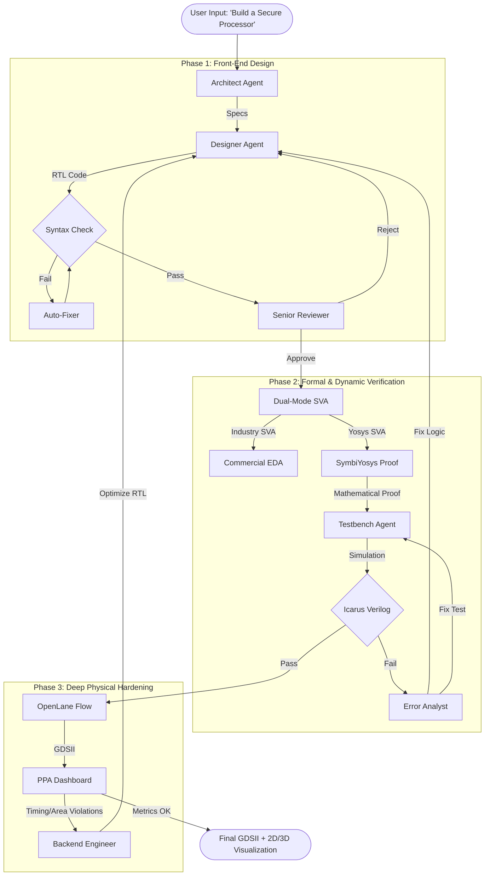

# AgentIC: Sovereign AI-Powered Silicon Design Framework

     

**AgentIC** is an automated, sovereign AI Agent framework that transforms natural language descriptions directly into industry-standard physical chip layouts (GDSII). Unlike simple code generators, AgentIC employs a **Self-Correcting Multi-Agent System** that iteratively designs, verifies, fixes, and physically hardens custom silicon.

It acts as a **"Text-to-Silicon" Compiler**, orchestrating a crew of specialized AI agents (Architect, Designer, Verification Engineer, Physical Design Lead) to ensure functional correctness and manufacturability—with a focus on **Atmanirbhar (Self-Reliant) Defense Applications**.

---

## 🌊 The Flow: From Text to GDSII

AgentIC does not just write code; it follows a rigorous engineering pipeline.



---

## 🚀 Key Capabilities v3.0

### 1. 🖥️ Mission Control Web UI (NEW)
A full-featured **Streamlit-based Web Dashboard** with a futuristic "Deep Space" glassmorphism theme:
*   **Dashboard**: Real-time PPA metrics (WNS, Power, Area, Gate Count) with live extraction from OpenLane runs
*   **AI Advisor**: Intelligent diagnostics and optimization recommendations based on design analysis
*   **Design Studio**: Natural language design input + integrated Verilog code editor (Monaco/Ace)
*   **Market Benchmarking**: Compare your indigenous designs against industry standards (Nvidia Jetson, Military FPGAs, etc.)
*   **Fabrication**: 2D SVG layout preview + interactive 3D layer stack visualization (Sky130 layers)
*   **GDSII Download**: One-click tapeout file download

### 2. 🛡️ Robust "Anti-Hallucination" Engine
Traditional LLMs often leak "thought processes" or Markdown artifacts into code, breaking compilers. AgentIC v3.0 features:
*   **Hardened VLSI Tools**: Custom I/O handlers (`vlsi_tools.py`) that strictly sanitize outputs, stripping `<think>` tags, "Thought:", "Action:", and non-Verilog artifacts.
*   **Compiler-Aware Auto-Fix**: Automatically detects and repairs syntax errors (e.g., mismatched port widths, invalid SystemVerilog constructs) without human intervention.
*   **Security Audit**: Built-in `SecurityCheck()` function scans for malicious patterns (`$system`, shell commands, etc.)
*   **Filesystem Guard**: Enforces correct file extensions (`.sv`, `.v`, `.tcl`) and prevents file path traversal attacks.

### 3. 🧠 Dual-Mode Formal Verification (NEW)
*   **Industry-Standard SVA**: Generates proper `property`/`assert property` SystemVerilog Assertions compatible with commercial tools (Synopsys, Cadence)
*   **Yosys-Compatible SVA**: Auto-converts assertions to SymbiYosys format for open-source k-induction proofs
*   **Dynamic Simulation**: Generates self-checking testbenches with proper FSM timing analysis
*   **Root Cause Analysis**: AI `Error Analyst` determines if bugs are in RTL or Testbench, fixing the correct file

### 4. 🔄 Resilient LLM Fallback Chain (NEW)
Multi-tier LLM failover for operational continuity:
```
NVIDIA Nemotron/Llama 405B → NVIDIA Backup → Groq Cloud → Local LLM
```
*   Supports air-gapped deployment with local models (Qwen Coder, Llama)
*   Automatic fallback on API failures

### 5. 🏭 Physical Design Feedback Loop (PPA)
*   **Beyond Code**: AgentIC checks real-world metrics—**Power, Performance (Timing), and Area**.
*   **Dynamic Standards**: Automatically calculates expected PPA standards based on gate count and design complexity
*   **Optimization Cycle**: 
    *   If **Timing** fails (Negative Slack), the agent inserts pipeline stages.
    *   If **Area** is too high (Congestion), the agent simplifies logic or increases core size.
*   **OpenLane Integration**: Full control over `config.tcl` generation and disaster recovery.

### 6. 🇮🇳 Atmanirbhar Benchmarking (NEW)
Compare your sovereign designs against market alternatives:
*   **Cost Analysis**: INR-based unit cost comparison with savings calculation
*   **Performance Radar**: Power efficiency, manufacturing readiness, supply chain independence, security trust
*   **AI Verdict**: Automatic domain detection (Security, Edge AI, General Purpose) with deployment recommendations

---

## 📦 Installation

### Prerequisites
*   **Linux/WSL2** (Ubuntu 20.04+ recommended)
*   **Python 3.10+**
*   **Docker** (for OpenLane)
*   **Icarus Verilog** (`sudo apt install iverilog`)
*   **GTKWave** (optional, for viewing waveforms)
*   **SymbiYosys** (optional, for formal verification - install via [oss-cad-suite](https://github.com/YosysHQ/oss-cad-suite-build))

### Setup

1.  **Clone the Repository**
    ```bash
    git clone https://github.com/Vickyrrrrrr/AgentIC.git
    cd AgentIC
    ```

2.  **Install Dependencies**
    ```bash
    pip install -r requirements.txt
    ```

3.  **Configure Environment**
    Create a `.env` file in the root directory:
    ```bash
    # LLM Provider (Examples - uses fallback chain automatically)
    NVIDIA_API_KEY="nvapi-..."
    # OR
    GROQ_API_KEY="gsk_..."
    # OR 
    OPENAI_API_KEY="sk-..."
    
    # Tool Paths (Optional, defaults provided)
    OPENLANE_ROOT="/home/user/OpenLane"
    PDK_ROOT="/home/user/pdk"
    ```

---

## 💻 Usage

### 1. 🚀 Launch Web UI (Recommended)
The easiest way to use AgentIC is via the Mission Control dashboard:
```bash
streamlit run AgentIC/app.py
```
Then open `http://localhost:8501` in your browser.

### 2. Build a Chip (CLI)
The `build` command runs the full flow: Architecture → RTL → Verify → GDSII.

```bash
python3 AgentIC/main.py build \
    --name bharat_secure_comm \
    --desc "AES-256 encryption accelerator with key expansion and GCM authentication mode"
```

**Options:**
*   `--show-thinking`: Displays the raw "Thought Process" (DeepSeek/Qwen CoT) in the terminal.
*   `--skip-openlane`: Stops after verification (useful for quick RTL iteration).
*   `--max-retries 5`: Sets how many times the agent can attempt to fix its own errors.

### 3. Manual Simulation & Fix
If you have existing code and just want the agent to fix bugs:
```bash
python3 AgentIC/main.py simulate --name my_design --max-retries 10
```

### 4. Hardening Only
To run OpenLane physical design on an existing Verilog file:
```bash
python3 AgentIC/main.py harden --name my_design
```
Supports background execution for long runs (10-30+ minutes).

---

## 🏗️ Project Structure

```
AgentIC/
├── app.py                    # Streamlit Web UI (Mission Control)
├── main.py                   # CLI Entry Point
├── requirements.txt
├── src/
│   └── agentic/
│       ├── cli.py            # Core pipeline commands
│       ├── config.py         # LLM & path configuration
│       ├── agents/
│       │   ├── designer.py       # RTL generation agent
│       │   ├── testbench_designer.py
│       │   └── verifier.py       # SVA & error analysis agents
│       └── tools/
│           └── vlsi_tools.py     # File I/O, simulation, OpenLane
├── designs/                  # Example designs
└── artifacts/                # Generated GDSII outputs
```

### Agent Crew Architecture

| Agent | Role | Primary Tools |
| :--- | :--- | :--- |
| **Chief System Architect** | Defines Micro-Architecture, FSM States, Interfaces | Markdown Specs |
| **VLSI Designer** | Writes Synthesizable SystemVerilog RTL | `write_verilog`, `syntax_check_tool` |
| **Senior Silicon Architect** | QA - Rejects multi-drivers, latches, huge arrays | Static Analysis |
| **Verification Agent** | Industry SVA + Yosys SVA generation | `write_sby_config`, `convert_sva_to_yosys` |
| **Testbench Agent** | Self-checking testbench with FSM timing | `run_simulation` |
| **Error Analyst** | Root cause classification (RTL vs Testbench) | Log parsing |
| **Backend Engineer** | OpenLane config.tcl + PPA optimization | `run_openlane` |

---

## ❓ Troubleshooting

### "OpenLane Failed / Docker Error"
*   **Cause**: Docker not running or PDK mismatch.
*   **Fix**: Ensure `docker ps` works. Check `PDK_ROOT` matches your Sky130 install.

### "Simulation Failed (Compilation Error)"
*   **Cause**: LLM hallucinated invalid syntax.
*   **Fix**: AgentIC v3.0 auto-fixes most issues. Use `--max-retries 10` for complex designs.

### "Code contains 'Thought:' or `<think>` lines"
*   **Status**: **SOLVED**. The `vlsi_tools.py` regex filters strip these artifacts automatically.

### "Formal Verification Skipped"
*   **Cause**: SymbiYosys (sby) not installed.
*   **Fix**: Install [OSS CAD Suite](https://github.com/YosysHQ/oss-cad-suite-build) or continue without (industry SVA still generated for commercial tools).

### "LLM API Failed"
*   **Cause**: API key invalid or service down.
*   **Fix**: AgentIC automatically falls back through the chain: NVIDIA → Groq → Local. Ensure at least one valid key is set in `.env`.

---

## 🔐 Security Features

*   **No Code Exfiltration**: Supports fully local/air-gapped LLM deployment
*   **Input Sanitization**: Blocks `$system`, shell commands, and path traversal attacks
*   **Auditable Output**: All generated code is human-readable SystemVerilog (no binary blobs)
*   **Secure Communication Designs**: Built-in support for AES-256, GCM authentication, and tamper detection modules

---

## 🎯 Defense Application Examples

*   **Secure Lockout Mechanism**: FSM-based PIN verification with lockout after N failed attempts
*   **Bharat NPU**: Indigenous Neural Processing Unit for edge AI
*   **Secure Communication Block**: AES-256 with key expansion, encryption/decryption/authentication modes
*   **Tamper Detection**: Hardware-level tamper response with key zeroization

---

## 📜 License
MIT License. Free for Research and Sovereign Development.

---

## 🤝 Contributing
Contributions are welcome! Please see the project wiki for development guidelines.

## 📚 References
*   [OpenLane Documentation](https://openlane.readthedocs.io/)
*   [SkyWater 130nm PDK](https://skywater-pdk.readthedocs.io/)
*   [SymbiYosys Documentation](https://symbiyosys.readthedocs.io/)
