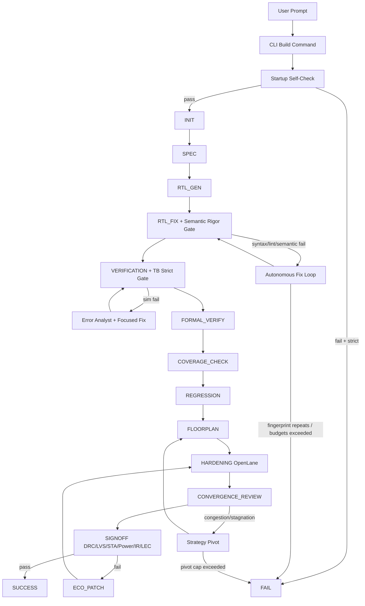

# AgentIC: Tier-1 Autonomous Text-to-Silicon


AgentIC converts natural-language hardware intent into RTL, verification artifacts, and OpenLane physical implementation with autonomous repair loops.

This README reflects the **Tier-1 upgrade**: strict fail-closed gates, bounded loop control, semantic rigor checks, multi-corner timing parsing, LEC integration, floorplan/convergence/ECO stages, and adapter-based OSS-PDK portability.

## Why this version is different

AgentIC is now built to avoid two expensive failure modes:

1. **Silent quality regression**: weak checks passing bad designs.
2. **Infinite churn**: retrying the same failing strategy forever.

Tier-1 addresses both.

## Tier-1 upgrade highlights

- **Fail-closed mode is first-class** (`--strict-gates` default).
- **Startup toolchain self-check** before build starts.
- **Deterministic semantic preflight** for:
  - width mismatch diagnostics,
  - port shadowing rejection.
- **Loop safety controls**:
  - failure fingerprint detection,
  - per-state retries,
  - global step budget,
  - capped strategy pivots.
- **EDA intelligence layer** to summarize large logs into structured top issues.
- **Physical feedback loop** with:
  - floorplan stage,
  - congestion assessment,
  - convergence assessor,
  - ECO stage.
- **Signoff upgrades**:
  - multi-corner STA parsing (setup + hold),
  - numeric power + IR-drop parsing,
  - EQY-based LEC check.
- **Hierarchy/IP scaling scaffold**:
  - auto hierarchy planner,
  - per-block artifact emission,
  - reusable `ip_manifest.json`.
- **CI split**:
  - PR smoke checks,
  - nightly full-flow path.

## Architecture (easy view)



## Autonomous repair model

AgentIC is not just an error printer. It has repair loops with decision logic.

### Loop behavior

- For compile/sim failures, it classifies cause (**TB vs RTL**) and applies targeted fixes.
- For large logs, it passes a **structured summary** instead of dumping raw text into prompts.
- If the same `(state + error + artifact fingerprint)` repeats, it fails closed instead of spinning.

### Convergence behavior

- Tracks timing/congestion snapshots per iteration.
- If WNS stagnates (< 0.01ns improvement for 2 consecutive iterations), triggers strategy pivot:
  1. timing constraint tune,
  2. area expansion,
  3. logic decoupling hint (register slicing),
  4. fail closed if capped pivots are exhausted.

## Quality gates (strict mode)

| Stage | Gate |
|---|---|
| Startup | required tools + environment must resolve |
| RTL Fix | syntax + lint + semantic rigor must pass |
| Verification | TB contract + simulation must pass |
| Formal | formal result is blocking in strict mode |
| Coverage | minimum coverage threshold is blocking |
| Regression | regression failures are blocking |
| Signoff | DRC/LVS/STA/power/IR/LEC all contribute to final pass/fail |

## PDK portability model

AgentIC uses an adapter-style OSS-PDK profile model.

Supported profiles now:

- `sky130`
- `gf180`

This is **portability support**, not foundry certification.

## CLI quick start

### 1) Standard strict build

```bash
python3 main.py build \
  --name my_chip \
  --desc "32-bit APB timer with interrupt" \
  --full-signoff
```

### 2) Portable profile selection

```bash
python3 main.py build \
  --name my_fifo \
  --desc "Dual-clock FIFO with status flags" \
  --pdk-profile sky130 \
  --strict-gates
```

### 3) Tune convergence controls

```bash
python3 main.py build \
  --name deep_pipeline \
  --desc "Pipelined datapath with valid/ready" \
  --max-pivots 2 \
  --congestion-threshold 10 \
  --hierarchical auto
```

## Build command options (Tier-1)

```text
--strict-gates / --no-strict-gates   (default: strict)
--pdk-profile {sky130,gf180}         (default: sky130)
--max-pivots N                        (default: 2)
--congestion-threshold FLOAT          (default: 10.0)
--hierarchical {auto,off,on}          (default: auto)
```

Existing options remain (`--skip-openlane`, `--full-signoff`, `--min-coverage`, `--max-retries`, etc.).

## Human-readable architecture internals

### Orchestrator states

`INIT -> SPEC -> RTL_GEN -> RTL_FIX -> VERIFICATION -> FORMAL_VERIFY -> COVERAGE_CHECK -> REGRESSION -> FLOORPLAN -> HARDENING -> CONVERGENCE_REVIEW -> SIGNOFF -> SUCCESS/FAIL`

With optional recovery path:

`SIGNOFF fail -> ECO_PATCH -> HARDENING -> CONVERGENCE_REVIEW`

### Key generated artifacts

- `config.tcl` (OpenLane config)
- `macro_placement.tcl` (floorplan macro scaffold)
- `<design>.eqy` (LEC config)
- `<design>_eco_patch.tcl` (ECO patch artifact)
- `ip_manifest.json` (reusable block metadata)
- `src/blocks/*.v` (hierarchy-enabled block artifacts)
- `metircs/<design>/latest.json` (industry benchmark snapshot)
- `metircs/<design>/latest.md` (human-readable benchmark table)

## CI model

### PR smoke checks

- Python compile check for `src/agentic`
- Tier-1 unit tests (`tests/test_tier1_upgrade.py`)

### Nightly full checks

- Runs smoke first
- Attempts full build+signoff path when environment is available

Files:

- `.github/workflows/ci.yml`
- `scripts/ci/smoke.sh`
- `scripts/ci/nightly_full.sh`

## Tests included for Tier-1

- conflict marker integrity checks
- semantic gate checks (port shadowing)
- log parser behavior on large synthetic logs
- multi-corner STA parser correctness
- congestion parser correctness
- loop fingerprint guard behavior
- hierarchy threshold activation

Run locally:

```bash
bash scripts/ci/smoke.sh
```

## Installation

### Prerequisites

- Linux / WSL2
- Python 3.10+
- Docker
- Verilator
- Icarus Verilog (`iverilog`, `vvp`)
- OpenLane installation
- OSS CAD tools for formal/LEC (`sby`, `yosys`, `eqy`)

### Setup

```bash
git clone https://github.com/Vickyrrrrrr/AgentIC.git
cd AgentIC
python3 -m venv .venv
source .venv/bin/activate
pip install -r requirements.txt
```

Configure `.env` (minimum):

```bash
# LLM backend
NVIDIA_API_KEY="..."          # cloud path
# or
LLM_BASE_URL="http://localhost:11434"  # local path

# Physical flow roots
OPENLANE_ROOT="/home/user/OpenLane"
PDK_ROOT="/home/user/.ciel"
```

## Practical boundaries (current implementation)

- ECO and hierarchy are production-oriented scaffolds in this phase, with concrete artifacts and control flow, but not yet a full foundry-tuned incremental optimization stack.
- Portability means adapter-based OSS-PDK support, not tapeout certification claims.

## Project layout

```text
AgentIC/
├── main.py
├── src/agentic/
│   ├── cli.py
│   ├── config.py
│   ├── orchestrator.py
│   ├── agents/
│   └── tools/vlsi_tools.py
├── tests/test_tier1_upgrade.py
├── scripts/ci/
└── .github/workflows/ci.yml
```

## License

Proprietary and Confidential.

Copyright (c) 2026 Vicky Nishad.
All rights reserved.
