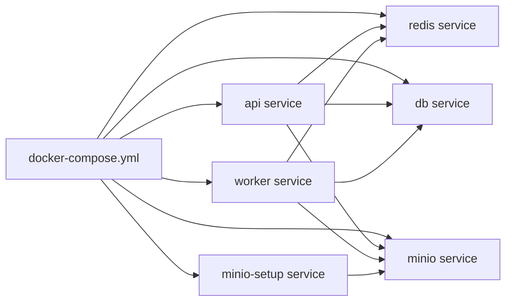

# Infrastructure & Docker Guide for Beginners

Welcome to the infrastructure guide! If you are new to scaling apps and deploying with Docker, this document will break down exactly what we are doing, why certain files exist, and what tools we are using to make AgentIC scalable.

## 1. What is a \`Dockerfile\`?
Think of a \`Dockerfile\` as a **recipe for baking a computer environment**. 
Instead of manually installing Python, Node.js, compiling Yosys, Verilator, etc., on every new computer, the \`Dockerfile\` tells Docker exactly how to build an empty Linux machine into a fully working AgentIC server from scratch.

**Its purpose here:** It installs all the heavy VLSI/EDA tools (like \`iverilog\`, \`gtkwave\`, \`yosys\`), copies our Python source code into the machine, installs Python libraries from \`requirements.txt\`, and builds the frontend React UI. It outputs an "Image" which can run anywhere exactly the same way.

## 2. What is \`.dockerignore\`?
A \`.dockerignore\` file is like the bouncer at a club—it prevents unnecessary or secret files on your host computer from entering the Docker build process. 

### Why is it different from \`.gitignore\`?
*   **.gitignore:** Stops files from being uploaded to GitHub (e.g., your personal \`agentic_jobs.db\` or \`node_modules/\`). 
*   **.dockerignore:** Stops files from being copied from your laptop into the Docker Image during the \`docker build\` step. 

### Why do we need it here?
If you don't have a \`.dockerignore\`, Docker will attempt to copy *everything* in the folder into the container. 
*   If we copied the \`designs/\` folder, your Docker build could take 20 minutes copying huge output files!
*   If we copied \`agentic_jobs.db\`, the Docker container would accidentally start with your old broken local database state instead of a fresh one.
*   If we copied \`oss-cad-suite/\`, the image size would inflate by gigabytes unnecessarily.

*(I just checked both files and added missing items like \`agentic_jobs.db\` and the temporary \`fix_*.py\` scripts. Keeping these files out keeps our image small and prevents local bugs from leaking into production!)*

## 3. How Are We Scaling the Infrastructure? (The Tools Explained)

To make this app scalable beyond a single terminal script, we split it into background microservices using **Docker Compose**. Here are the tools we are using:

### A. FastAPI (The "API" Service)
*   **What it does:** It runs our web server. When a user clicks "Build Chip", FastAPI instantly accepts the request and returns "Started!". 
*   **Why a noob cares:** Without it being separate, if the AI takes 10 minutes to write Verilog, the entire web page would freeze for 10 minutes waiting for a response.

### B. Celery (The "Worker" Service)
*   **What it does:** It runs in the background picking up the heavy math/LLM tasks.
*   **Why a noob cares:** We can spin up 1 worker or 100 workers. As more users request chip designs, Celery neatly queues them up and works through them without crushing the API server.

### C. Redis (The Message Broker)
*   **What it does:** It acts as a super-fast post office between FastAPI and Celery. 
*   **Why a noob cares:** FastAPI drops a message ("Please build an 8-bit counter") into Redis. The Celery Worker immediately sees the message in Redis and starts working. 

### D. PostgreSQL (The Database)
*   **What it does:** A robust, enterprise-grade database that replaces our simple \`agentic_jobs.db\` (SQLite).
*   **Why a noob cares:** If the server crashes and restarts, PostgreSQL remembers exactly what jobs were running, who requested them, and their status.

### E. MinIO (S3-Compatible Object Storage)
*   **What it does:** It acts exactly like Amazon S3, but runs locally.
*   **Why a noob cares:** When the worker generates thousands of VLSI artifacts (GDS files, logs, VCD waveforms), it uploads them to MinIO. Then the user can securely download them via a public link, rather than trying to fish them out of the server's hard drive.

## 4. How docker-compose.yml Maps to the Flow Diagram

This file is the controller that starts each box in the diagram and connects them together. Each service in the compose file becomes one part of the runtime stack.

What each part means:
*   **api service:** The FastAPI web server that receives user requests.
*   **worker service:** The background job runner that does the slow work.
*   **redis service:** The queue that passes jobs from the API to the worker.
*   **db service:** The PostgreSQL database that stores job state.
*   **minio service:** The artifact store for design outputs and logs.
*   **minio-setup service:** The helper container that creates the bucket automatically.

In plain words, the compose file is the switchboard. It decides which containers exist, how they can reach each other, what ports they expose, and which ones must start first.

## 5. The Integration Error We Fixed
You might have noticed an error when running \`docker-compose up\`:
\`dial tcp: connect: connection refused\` from the \`minio-setup\` container.

**What happened:** Docker tried to configure the MinIO database (creating the \`agentic-artifacts\` bucket) *before* MinIO had fully finished booting up.
**The Fix:** I modified \`docker-compose.yml\` to add an \`until\` loop. Now, the setup script patiently runs \`sleep 2; echo 'waiting...'\` until MinIO is fully awake and ready to accept commands. 

---
### Summary
By combining Docker, Redis, Celery, and MinIO, we transformed a tiny local Python script into a robust web-scale application capable of handling multiple concurrent users generating chip designs on the cloud!