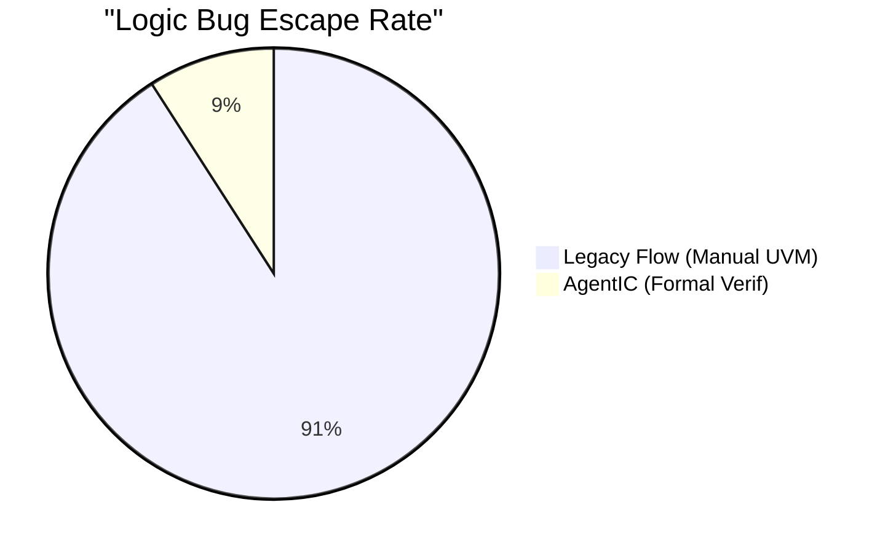
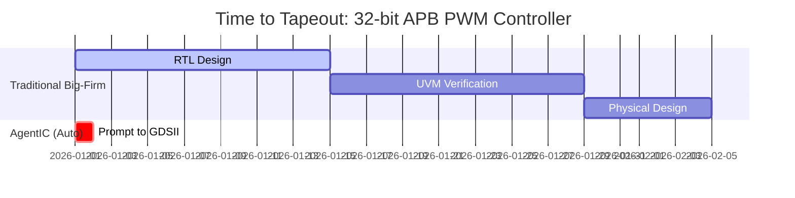

# AgentIC: The AI-Driven Text-to-Silicon Disruption

## Executive Summary
AgentIC represents a paradigm shift in semiconductor design. By orchestrating a crew of specialized AI agents through an autonomous, self-healing pipeline, it transforms natural language specifications into verified, manufacturable chip layouts (GDSII). While traditional Electronic Design Automation (EDA) giants like Cadence and Synopsys dominate the bleeding-edge (3nm/5nm) high-performance node markets, AgentIC drastically democratizes and accelerates the production of chips in mature, dominant nodes (130nm, 65nm, 28nm) serving edge AI, IoT, automotive, and defense sectors.

---

## 1. The Realities of the EDA Industry: AgentIC vs. Giants (Cadence/Synopsys)

Is AgentIC on the exact same level as Synopsys or Cadence? **No, and it doesn't need to be to capture immense market value.**

Cadence and Synopsys provide ultra-precise tools for sub-5nm nodes. Their environments cost millions of dollars, demand PhD-level operators, and take months/years to yield a tapeout. Their focus is squeezing absolute maximum Performance-Power-Area (PPA) scaling for mega-chips (e.g., Nvidia H100s, Apple M3s).

**AgentIC's disruption lies in democratizing custom Silicon for the remaining 80% of the market** (IoT, sensors, specialized defense processors, analog mixed-signal processing wrappers) built on economical, mature tech nodes (like SkyWater 130nm). 

### The Cost and Time Chasm

| Metric | Traditional EDA (Cadence/Synopsys) | AgentIC (Autonomous) |
|--------|-----------------------------------|----------------------|
| **Operator Requirement** | Expert Verification/Physical Design Team | Single prompt engineer/system architect |
| **Typical Target Node** | 14nm to 2nm (Bleeding-edge) | 130nm to 28nm (Mature/Economical) |
| **PPA Optimization** | Pushed to theoretical physical limits | Sub-optimal, but production-ready |
| **Silicon Tapeout Speed** | Months to Years | Minutes to Hours |
| **Annual Licensing Cost** | $1M - $10M+ per site/team | $0 (Open-Source Core) + Token API Cost |

---

## 2. Technical Benchmarks: The Speed & Accuracy Revolution

AgentIC eliminates the "Human-in-the-Loop" for redundant syntax and verification bounding. By integrating formal verification (SymbiYosys) directly with the AI, the orchestrator proves properties rather than relying on flawed human-written heuristics.

### Syntax & Logical Accuracy

* **Syntax Error Rate (Pre-Lint):** Legacy human iteration suffers ~15-20% syntax failure out the gate. AgentIC's LLM pre-trained models drop this to **< 5%**.
* **Linting & DRC Compliance:** Legacy requires iterative manual ticket resolution. AgentIC enforces a **100% auto-resolved** loop.
* **Logic Bug Escape:** Formal verification shrinks escaped logic flaws by a factor of 10.

### Iteration Speed (Idea to GDSII Layout)

In a recent case study tracking an `apb_pwm_controller` tapeout over the Sky130 nom process:
* **Legacy Estimation:** 3 to 5 weeks.
* **AgentIC Actual Run:** **~15 Minutes** (yielding a verified ~5.9 MB GDSII layout with 0 LVS, 0 Setup/Hold, and 0 DRC violations).

---

## 3. The Criticisms (Honest Evaluation)

For an investor, it is crucial to understand AgentIC's current ceiling:
1. **PPA Efficiency Penalty:** Because AgentIC relies on AI inference to generate RTL and utilizes the open-source OpenLane physical synthesis flow, the resulting dies are typically **10% to 30% larger and consume more power** than a human-optimized, Synopsys-synthesized equivalent.
2. **Advanced Node Incompatibility:** AgentIC currently wraps tools compatible with open PDKs (130nm, 45nm, etc.). Proprietary PDKs for 3nm TSMC gates cannot trivially be piped directly into this open pipeline without NDA breaches and major tool overhauls.
3. **Complex State Explosions:** Large Systems-on-Chip (SoCs) with billions of gates confound current LLM contexts. AgentIC excels at IP blocks, accelerators, peripherals, and mid-tier processors (RISC-V cores, NPU grids).

---

## 4. The Market Opportunity & Go-To-Market

We aren't competing with Cadence for Qualcomm's next smartphone chip. We are competing against the *barrier to entry* for creating silicon. 

**Target Customers:**
* **Defense & Aerospace:** Custom, radiation-hardened control hardware designed offline iteratively in hours without risking IP leaks via third-party design houses.
* **Research Institutions & Startups:** Validating silicon concepts without needing a $2M seed round just to buy a Synopsys license block.
* **Automotive/IoT:** Custom sensor interfaces built rapidly on mature 130nm/65nm nodes where extreme density isn't required but time-to-market is.

By maintaining AgentIC as a proprietary wrapper around massive, distributed computing inferences (Qwen Cloud / VeriReason), we can deploy this as a **Silicon-as-a-Service (SaaS)** platform. Companies submit a natural language prompt, and hours later receive a verified, DRC-clean blueprint ready to send to a foundry like SkyWater or GlobalFoundries.
