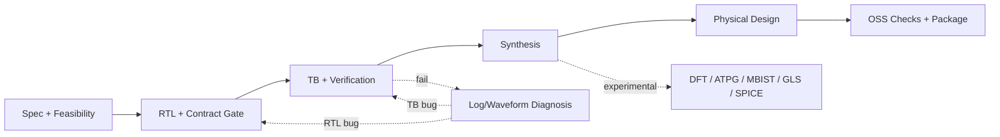

# AgentIC VLSI Pipeline

This document describes the current AgentIC chip-build flow and its limits.

## Handoff and Signoff Architecture

AgentIC's open-source flow is designed to rapidly produce an **OSS layout candidate**, serving as a robust foundation that seamlessly integrates into commercial fabrication-ready signoff workflows.

```text
Default OSS flow:
  OSS_LAYOUT_CANDIDATE

Enhanced OSS testing flow:
  OSS_TEST_ENHANCED_LAYOUT_CANDIDATE

Commercial/foundry signoff flow:
  FAB_READY (Requires proprietary/foundry signoff integration)
```

The `agentic setup-cli` command installs the comprehensive open-source execution stack and experimental testing helpers. For proprietary and licensed toolchains (e.g., foundry PDKs, Calibre, Pegasus, ICV, PrimeTime, Tempus, Innovus, Fusion Compiler, Tessent, Modus, TetraMAX, or vendor MBIST compilers), AgentIC provides an integration layer via `~/.agentic/commercial-tools.env`.

Pipeline Capabilities and Handoff:

- **Rapid Prototyping:** The open-source toolchain efficiently handles RTL generation, verification, synthesis, layout, timing analysis, and provides foundational DRC/LVS evidence and reports.
- **Commercial Integration:** To achieve final fabrication readiness, the generated layout candidate is handed off to commercial tools for foundry-qualified signoff, production DFT/ATPG/MBIST, precision STA, extraction, IR/EM analysis, and final foundry-accepted GDS/OASIS verification.
- **Advanced Testing:** Features such as DFT scan, ATPG, MBIST, GLS, and post-layout SPICE are provided as initial testing integrations, fully realizable upon configuring the respective commercial/foundry tools.

## Flow Profiles

### `sky130_oss_executable`

Default executable open-source flow:

```text
spec
-> feasibility and PDK reconciliation
-> RTL generation
-> RTL contract gate
-> lint/syntax/width repair
-> testbench generation
-> simulation/formal/coverage
-> SDC generation
-> Yosys synthesis
-> OpenLane/OpenROAD physical design
-> OpenSTA timing
-> Magic/Netgen physical checks
-> report/package
```

Excluded by default:

```text
DFT_SCAN
DFT_ATPG
MBIST
GLS_SIMULATION
POST_LAYOUT_SPICE
```

### `sky130_oss_experimental_complete`

Adds experimental extensions:

```text
DFT_SCAN
DFT_ATPG
MBIST
GLS_SIMULATION
POST_LAYOUT_SPICE
```

These stages can provide research evidence, but they are not production signoff.

## Pipeline Diagram

```text
1. Spec / PDK / Feasibility
   PDK setup
   -> spec generation
   -> spec validation
   -> hierarchy expansion
   -> feasibility check
   -> PDK-aware reconciliation
   -> CDC analysis

2. RTL Generation
   verification plan
   -> RTL generation
   -> universal RTL contract gate
   -> RTL syntax/lint/width repair

3. Verification
   testbench from actual RTL ports
   -> static TB gate
   -> Verilator compile gate
   -> simulation
   -> formal checks
   -> coverage/regression

   If simulation fails:
   logs/waveforms
   -> classify RTL bug or TB bug
   -> repair RTL or regenerate/fix TB
   -> rerun gates and simulation

4. Synthesis
   SDC generation
   -> Yosys synthesis
   -> optional LEC/EQY evidence

5. Optional Experimental Extensions
   scan
   -> ATPG
   -> MBIST wrapper
   -> GLS
   -> scoped post-layout SPICE

6. Physical Design
   floorplan/macro planning
   -> placement
   -> CTS
   -> routing
   -> OpenSTA timing
   -> ECO/floorplan recovery if needed

7. OSS Checks and Packaging
   power estimate
   -> Magic DRC / antenna evidence
   -> Netgen LVS evidence
   -> GDS/LEF/reports
   -> IP package
```



## Universal RTL Contract Gate

Before synthesis, AgentIC enforces PDK-aware RTL rules:

- Large SRAM/RAM/ROM/register-file storage becomes a memory macro wrapper.
- ADC, DAC, PLL, TRNG, bandgap, LDO, and other analog/custom blocks become
  hard-macro interfaces unless real macro collateral is supplied.
- Internal `inout` and internal tri-state buses are rejected.
- Internal bidirectional intent is rewritten as `*_i`, `*_o`, and `*_oe`.
- Only top-level pad boundaries may use `inout`.
- Required macro modules must be black-box wrappers and must not contain
  synthesizable `reg mem[...]` arrays.

Source of truth:

```text
designs/<name>/src/*.v
reconciled_spec.json
spec_change_log.json
```

Derived artifacts such as `*_combined.v`, `synth_out/*`, SPICE files, and gate
JSON reports are evidence from a specific run. They must be regenerated or
treated as stale when RTL changes.

## Testbench Verification Flow

AgentIC does not blindly trust an LLM-generated testbench.

```text
RTL generated
-> testbench generated from actual ports
-> static TB gate
-> Verilator compile gate
-> simulation
-> waveform/log analysis if failed
-> RTL or TB repair loop
```

Checks:

- Static gate: DUT instance, stimulus, checking logic, and `TEST PASSED` /
  `TEST FAILED` markers.
- Compile gate: RTL and testbench compile together with Verilator.
- Simulation: behavior is checked by the self-checking testbench.
- Failure diagnosis: logs/waveforms decide whether to repair RTL or TB.

## Experimental Stages

### DFT Scan and ATPG

Open/free tools may provide partial scan/ATPG evidence. Production DFT still
requires commercial-grade scan insertion, ATPG coverage closure, test-mode
constraints, physical awareness, and ATE-ready pattern export.

### MBIST

Generated MBIST wrappers are not a replacement for a real MBIST compiler or
memory-vendor BIST/BISR collateral.

### GLS

GLS is meaningful only with a mapped gate netlist, cell simulation models, SDF,
SDF back-annotation, and a compatible simulator. Without SDF, it is a gate-level
sanity check, not timing signoff.

### Post-Layout SPICE

SPICE is useful for analog blocks, SRAM/custom cells, IO/pads, tiny extracted
blocks, or selected critical paths. Full-chip SPICE for a digital SoC is usually
not practical.

## Commercial Signoff Integration

To achieve final fabrication readiness, the OSS layout candidate smoothly transitions into commercial workflows. This final handoff typically includes:

- Execution of foundry-qualified DRC/LVS/antenna/DFM decks
- Multi-corner multi-mode signoff STA
- Signoff-grade parasitic extraction
- IR drop and electromigration (EM) analysis
- Comprehensive reliability checks
- Production-grade DFT scan insertion
- ATPG fault coverage and ATE pattern generation
- MBIST/BISR implementation for memories
- Final GDS/OASIS validation accepted by the foundry

AgentIC accelerates the upstream design and verification process, preparing a high-quality foundation and gathering extensive open-source evidence. This empowers engineering teams to focus their efforts on the critical, node-specific foundry and commercial signoff phases.
