# Industry-Standard VLSI Pipeline Architecture

This document maps the AgentIC orchestrator flow to an industry-standard ASIC/VLSI pipeline. It details the exact sequence of stages from initial architecture to final tape-out, highlighting the specific EDA tools and physical signoff mechanisms invoked at each step.

## RTL-to-GDSII Pipeline Flow

The execution loop operates as an automated RTL-to-GDSII pipeline, heavily utilizing the OSS-CAD-Suite and OpenLane/OpenROAD toolchains.

```mermaid
flowchart TD
    %% 1. Specification
    subgraph Spec ["1. Architecture & Spec"]
        direction TB
        INIT["PDK Setup"]
        SPEC["Spec Generation"]
        SPEC_VAL["Spec Validation"]
        HIER_EXP["Hierarchy Expansion"]
        FEAS_CHK["Feasibility Check"]
        CDC["CDC Analysis"]
        
        INIT --> SPEC --> SPEC_VAL --> HIER_EXP --> FEAS_CHK --> CDC
    end

    %% 2. RTL
    subgraph RTL ["2. RTL Implementation"]
        direction TB
        VERIF_PLAN["Verification Plan"]
        RTL_GEN["RTL Generation"]
        RTL_FIX["Lint & Syntax Fix"]
        
        VERIF_PLAN --> RTL_GEN --> RTL_FIX
        RTL_FIX -. "Lint Errors" .-> RTL_GEN
    end

    %% 3. Verification
    subgraph Verif ["3. Verification"]
        direction TB
        SIM["Functional Sim"]
        FORMAL["Formal Verif"]
        COV["Coverage Check"]
        REGRESS["Regression"]
        
        SIM --> FORMAL --> COV
        COV -. "Low Coverage" .-> SIM
        COV --> REGRESS
    end

    %% 4. Synthesis
    subgraph Logic ["4. Synthesis & DFT"]
        direction TB
        SDC["SDC Constraints"]
        SYNTH["Logic Synthesis"]
        SCAN["Scan Insertion"]
        ATPG["ATPG Pattern Gen"]
        MBIST["Memory BIST"]
        GLS["Gate-Level Sim"]
        
        SDC --> SYNTH --> SCAN --> ATPG --> MBIST --> GLS
    end

    %% 5. Physical
    subgraph PD ["5. Physical Design"]
        direction TB
        FP["Floorplan & Macro"]
        PLACE["Place & Route"]
        STA["Static Timing (STA)"]
        CONV["Convergence"]
        ECO["ECO Patch"]
        
        FP --> PLACE --> STA --> CONV
        CONV -. "Setup/Hold Violation" .-> ECO
        CONV -. "Congestion" .-> FP
    end

    %% 6. Signoff
    subgraph SignoffPhase ["6. Signoff"]
        direction TB
        PWR["Power Analysis"]
        PHYS["DRC / LVS Signoff"]
        POST_SIM["Post-Layout SPICE"]
        GDS["GDSII Export"]
        IP["IP Package"]
        
        PWR --> PHYS --> POST_SIM --> GDS --> IP
    end

    %% Connect the major phases linearly
    CDC --> VERIF_PLAN
    RTL_FIX --> SIM
    SIM -. "Logic Bugs" .-> RTL_GEN
    REGRESS --> SDC
    GLS --> FP
    ECO --> PWR
    CONV --> PWR
```

## Toolchain & Pipeline Mapping

An industry-standard ASIC flow integrates multiple specialized tools. Below is exactly what happens under the hood during the pipeline stages:

### 1. Specification & Planning (`SPEC` ➔ `CDC_ANALYZE`)
- **Action:** Decomposes the design into sub-modules, assigns clock domains, and establishes microarchitectural contracts.
- **Feasibility:** Checks required Gate Equivalents (GE), assesses OpenRAM macro requirements, and flags multi-clock asynchronous resets.

### 2. RTL Design & Linting (`RTL_GEN` ➔ `RTL_FIX`)
- **Tools:** `Verilator` (linting), `Slang` (SystemVerilog validation).
- **Action:** SystemVerilog modules are generated and immediately compiled. The `IncrementalFixEngine` surgically resolves lint errors (e.g., width mismatches, undeclared nets) based strictly on Verilator outputs before the design is allowed to proceed to verification.

### 3. Verification & Formal (`VERIFICATION` ➔ `REGRESSION`)
- **Simulation:** `Icarus Verilog (iverilog/vvp)` or `Verilator` is used to compile testbenches against the RTL.
- **Formal:** `SymbiYosys (sby)` evaluates SystemVerilog Assertions (SVA) for property checking, boundedness, and liveness.
- **Coverage:** Line, toggle, and branch coverage is collected. If coverage dips below the `min_coverage` threshold (e.g., 80%), the pipeline loops back to augment the testbench.

### 4. Synthesis & DFT (`SYNTHESIS` ➔ `GLS_SIMULATION`)
- **Constraints:** `OpenROAD` constraint generation (SDC files).
- **Synthesis:** `Yosys` maps RTL to standard cells (e.g., Sky130).
- **DFT & Equivalence:** `Eqy` is used for Logic Equivalence Checking (LEC) to ensure the synthesized netlist perfectly matches the RTL logic. Scan insertion and ATPG are handled in the backend flow.
- **GLS:** Gate-Level Simulation confirms the netlist still satisfies the testbench post-synthesis.

### 5. Physical Design (`FLOORPLAN` ➔ `ECO_PATCH`)
- **Tools:** `OpenLane` and `OpenROAD` environment.
- **Action:** Core utilization, die area, macro placement, pin configuration, Clock Tree Synthesis (CTS), and global/detailed routing.
- **Automated Convergence:** The orchestrator extracts Worst Negative Slack (WNS), Total Negative Slack (TNS), and routing congestion from OpenROAD logs. If setup/hold violations or heavy routing congestion occurs, the pipeline dynamically reverts to `FLOORPLAN` (to adjust density) or applies an `ECO_PATCH`.

### 6. Signoff (`POWER_ANALYSIS` ➔ `IP_PACKAGE`)
- **Timing:** `OpenSTA` validates final post-route setup, hold, and slew metrics.
- **Physical Verification:** `Magic` handles Design Rule Checks (DRC) and antenna checks, while `Netgen` performs Layout vs Schematic (LVS) matching.
- **Output:** The orchestrator generates a clean GDSII layout, LEF macros, and SPEF parasitics, officially completing the pipeline (`SUCCESS`).

## Error Parsing and Convergence Mitigation
In a real VLSI flow, tools frequently encounter physical limits. The orchestrator handles EDA crashes proactively:

1. **Fingerprinting & State Tracking:** If an exact failure loops (e.g., a specific CDC violation or DRC spacing error), the state machine prevents infinite iterations by applying surgical logic fixes or relaxing constraints.
2. **Back-end Pipeline Recovery (`PipelineErrorRecovery`):** 
   - **Timing Failures:** Adjusts `SYNTH_STRATEGY` or target frequency in `config.tcl`.
   - **Congestion:** If global routing fails, the core utilization (`FP_CORE_UTIL`) is lowered dynamically, and macro placements are spaced further apart before restarting OpenLane.
   - **Equivalence Failures:** Triggers a halt and re-evaluates the Yosys synthesis mapping directives.
